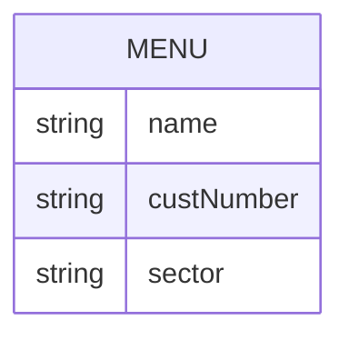

# 数据库设计

## 表设计

项目目前一共`15`张表(collection)，后台代码中的`_db`文件夹就是数据库初始化数据(共13个json文件)，通过`studio3T`或者其他的数据库工具导入json即可(登录日志和操作日志表没有导出)。

- 菜单表(menu)

```mermaid
erDiagram
    MENU {
        string name
        string custNumber
        string sector
    }
```
