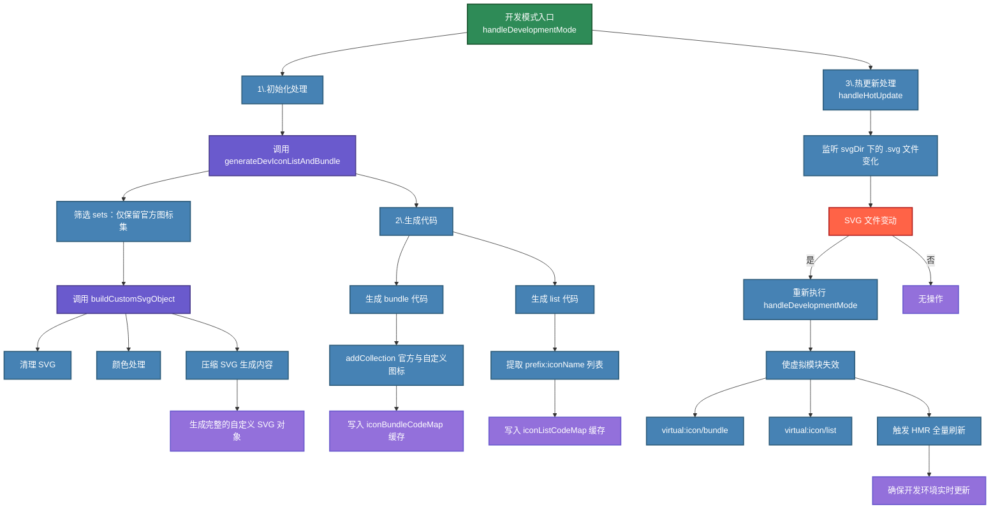
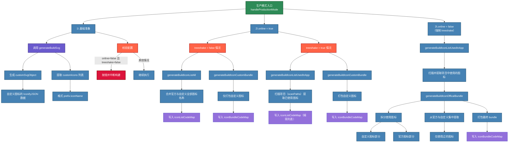

# <WPageTitle></WPageTitle>

## 老文档

### 介绍

项目没有采用 naive-ui 的图标，而是采用了[iconify](https://iconify.design/)的 [vue3](https://docs.iconify.design/icon-components/vue/) 的组件方案。（在采用 `unocss` 的时候试过更换为 uno 的纯 class 图标，但是效果并不理想。所以还是坚持用了 `iconify`）

### 原因

采用 iconify 的原因很简单：图标选择很多很广且 api 功能强大。配套的`@iconify/json-tools`、`@iconify/utils`和`@iconify/tools`提供的 api 都足以支撑图标功能的开发。且官网文档很详细，配套打包的代码官网都有现成的，想要二次扩展也很容易。

### 用法

```vue
// 图标集 - 冒号前是图标集的名称，即前缀。冒号后是图标的名称。
<template>
  <WIcon icon="ant-design:home-outlined" />
</template>
```

### 设计

经过几次的改动，现在的应该是最终的版本了，之后不会再有大规模的变动了。

#### 图标命令

以下两个命令执行的是同一个入口文件，只不过对环境做了区分。

- 开发环境

默认是在`predev`的 `npmhook` 执行，如果觉得启动时太慢，手动执行一次后删掉`predev`中的`npm run icon:dev`即可。

```bash
npm run icon:dev
```

- 打包环境

默认是在`prebuild`的 `npmhook` 执行。在`staging build`时是手动执行下面命令后执行的打包命令。

```bash
npm run icon:prod
```

#### 图标配置

<div style="width: 100%;margin: 16px 0;">
  
</div>

- `online` 布尔值 默认 false 是否采用在线方式打包

  - `true` 即不把图标打包到最后产物中，可以适量的减少打包体积（如果用的图标不多的话。图标用的多的，开启此选项打包体积会下降不少），在加载到图标时会通过 `iconify` 提供好的现成的`api`去请求用到的图标（`iconify` 这个 `api` 可以自定义配置，扩展配置性很强）。此情况需要给图标做加载效果，这也是前一段时间加上的（`skeleton` 加载效果）。此情况适用于可以连接外网的，且网络环境还不错的应用。

  - `false` 即会把图标打包到最后产物中，适用于在内网环境中的应用。生成图标体积会根据后一个配置项决定。

- `treeshake` 布尔值 默认 `true` 是否按需打包

  - `true` 即只打包项目中使用到的图标，推荐使用，可以很好的减小打包体积。（自定义图标也可以实现按需打包）具体使用的是`fast-glob`扫描 `src` 下的所有文件，利用一个图标的`pool`和正则去匹配项目中使用到的图标。

  - `false` 即不按需打包，不建议设置。如果在同时设置了`online`为 `false` 和`treeshake`为 `false` 会把图标集全量打包进产物中，打包体积会剧增（一般都是会增加 5~15M 左右，且会打进一个文件中，首屏加载速度会急剧变慢）。

- `list` 字符串数组 默认配置了 `6` 个图标集（`5` 个 `iconify` 的 + `1` 个自定义`svg`图标集）

  - 第一项常量是默认的自定义图标集`w-svg`

  - 后面的就是`iconify`提供好的`json`图标集，默认做了 5 个。如果想要添加新的内置图标集，去[这个文件夹](https://github.com/iconify/icon-sets/tree/master/json)里找想要的图标，赋值`json`的文件名然后添加到数组中，接着重新执行`npm run dev`即可。

  - 这个数组也是`图标选择器`的过滤分类数组

#### 具体流程

图标打包入口文件

```ts
import { generateIconUsedBundle } from '../generate/icon-bundle'
import { generateIconDevBundle } from '../generate/icon-bundle-dev'
import { generateIconBundleImport } from '../generate/icon-import'
import { cleanArr, generateIconList } from '../generate/icon-list'
import { generateIconsUsed } from '../generate/icon-scan'
import { generateIconSvg } from '../generate/icon-svg'
import { IconBundleConfig } from './config';

(async () => {
  // 获取命令行中的参数，是dev还是prod
  const arg = process.argv.slice(-1)[0]

  // 这步是不论环境的都要执行的
  // 这一步主要是把`.svg`文件夹下的自定义图标打包成`iconify`格式的json，方便后续操作
  // 逻辑抓的是iconify的例子，稍微做了些修改
  // 最后输出的文件在`build/_generated/svg.json`
  await generateIconSvg()

  // 这步也是不论环境的都要执行的
  // 这步依赖于上一步，只有在上一步生成了svg.json后这步才会把自定义图标字符串写入文件
  // 这一步是利用fast-glob和图标配置中的list生成图标选择器的图标字符串数组
  // 逻辑是自己写的，很简单，读取node_modules下的iconify/json文件，加上前缀然后写入文件
  // 写入了两个文件，一个list一个list-pool文件
  // list文件后续可能重新写入，pool文件用作treeshake的扫描用
  await generateIconList()

  // 下面环境处理，不同环境需要做不同处理
  if (arg === 'dev') {
    // 开发环境下是从node_modules里引入的json，然后调用addCollection把图标添加进去
    // 逻辑是自己写的，可以看一下
    await generateIconDevBundle()
  }
  else {
    // 开启了按需加载图标
    if (IconBundleConfig.treeshake) {
      // 利用fast-glob扫描src下的所有vue/ts/tsx文件
      // 读取icon-list-pool和正则匹配筛选出用到的图标字符串
      // 重新写入到icon-list文件中，用于图标选择器
      await generateIconsUsed()

      // 如果是离线用法，需要把图标通过addCollection添加到iconify中
      // 在线使用的话，只需要上一步的图标字符串数组
      if (!IconBundleConfig.online) {
        // 逻辑是iconify文档中提供的离线打包
        // 打包示例提供了自定义svg、图标字符串和json文件的打包逻辑
        // 我只用到了图标字符串的打包逻辑
        // 稍微做了些改动，因为自定义的svg图标需要提供json路径
        await generateIconUsedBundle()
      }
    }
    else {
      // 没开启按需加载就需要把iconify图标集通量打包
      // 同样的逻辑，只不过没有了`generateIconsUsed`这步骤
      // 因为下面的这步操作全是依靠icon-list文件中的图标字符串做的处理
      await generateIconUsedBundle()
    }
  }

  // 这步始终都要执行
  // 这步是去读写`Icon/index.ts`文件
  // 目的是把addCollection这步操作引入到项目中
  // 开发环境下一定是需要引入的，要不就变成在线使用图标了（虽然也可以
  // 同时online配置也会影响写入操作，逻辑看下文件就行，不复杂
  await generateIconBundleImport(arg)

  cleanArr()
})()
```

### 图标集

在开发环境下会整体安装[@iconify/json](https://icon-sets.iconify.design/)，大约有 `100` 多 M。图标集数量将近 `100` 个。

如果想要添加新的图标集，则在[config.ts](https://github.com/Zhaocl1997/walnut-admin-client/blob/naive-ui/build/icon/src/config.ts)文件中的`list`属性添加想要的`图标集字符串`，然后执行重新执行`npm run dev`即可。

:::warning
`list`数组的第一项即自定义图标的前缀，不要轻易删除
:::

:::info
`图标集字符串`需要完全等于[这个](https://github.com/iconify/icon-sets/tree/master/json)文件夹下的文件名称，因为是根据这个去做的检索。
:::

### 图标选择器

图标选择器为项目二封的组件，一般来说只有在配置菜单时才用的到。设计思路也很简单，通过上面提到的`icon-list`文件中的`图标字符串`数组渲染图标，在`Icon/index.ts`下引入了`bundle`文件就是离线使用的方式，没引入就是在线使用的方式（根据图标字符串去做网络请求）。

同时图标选择器做了分页、搜索和按图标集过滤的强化，方便开发者使用。

### 自定义图标

项目的根目录下有个`.svg`的文件夹，这里是存放自定义图标的地方。（去阿里的 `iconfont` 或其他地方下载的 `svg` 图标可以直接扔到此文件夹下）

:::warning
目前只支持以 `svg` 文件形式的自定义图标（复制粘贴 `svg` 很麻烦，能下载成文件就下载成 `svg` 文件吧）
:::

:::warning
同时`.svg`文件夹下也不支持嵌套文件夹形式的图标，暂时只能平级扔到`.svg`文件夹下
:::

:::info
`svg` 的文件名就是使用时的图标名，尽量不要用中文名的 `svg` 文件
:::

:::info
这个文件夹下的内容不会打包到最终产物中，所以可以尽情的添加 `svg` 文件
:::

#### 命令

在`.svg`文件夹下添加完 svg 文件后，重新执行`npm run dev`即可，图标处理的逻辑在`predev`中已做完处理。

#### 原理

原理很简单，就是把 `svg` 文件转化成 `iconify` 的规则 `json` 格式，然后就把这个 `json` 文件对待为一个新的图标集。这样处理的话后续的打包逻辑就可以服用了，无需再重新写一套自定义 `svg` 的打包逻辑。

#### 用法

```vue
// 自定义图标 - `w-svg`是默认的自定义图标前缀，冒号后为svg的文件名称
<template>
  <WIcon icon="w-svg:svg-sample-1" />
</template>
```

### 打包

图标打包的逻辑，我也是经过了两次大的改动才磨练出现在的版本。之前的版本在没有很好的设计思路下就做了出来，导致整个逻辑不清晰。现在逐渐熟悉了`iconify`后清晰的了解了整个流程，重新设计了现在的这版打包逻辑处理，同时做了自定义的配置项目和最小的对`src`下的文件的改动。

#### 原理

图标打包的原理，一切都是基于`iconify`的`addCollection`api。`iconify`的`vue3`图标只有在执行了这个 `api` 的情况下才会是离线用法，如果没有调用这个`api`直接使用图标，`iconify`就会调用内置的`api`去做网络请求取回图标（上面也提到过，这个 api 是可以自定义搭建的，配置性很强）。

#### 流程

上面的[具体流程](#具体流程)已经写的比较清楚了

### 离线用法(推荐)

离线用法即把配置中的`online`设置为`false`即可，剩下的交给打包逻辑即可。

同时建议开始`treeshake`，可以最大化的减小最终产物体积。

:::warning
不要同时把`online`和`treeshake`设置为`false`，这样会把图标配置中的 list 图标集全量打包，会急剧增加打包体积，这是没人想看到的。
:::

### 在线用法

- ~~所有 iconify 的图标都会走网络请求，图标在加载出来之前会有一小段留白，效果并不好~~

  ***

  现已添加了骨架框加载的效果，不会有不好的留白效果了

- ~~请求完的 iconify 图标默认会把 svg 内容存储到 `localStorage` 中，在图标量巨大的情况下这并不理想。且 `localStorage` 有 5m 的存储上限，这么搞维护性很差。~~

  ***

  ~~~`iconify` 提供了一个不把请求到的图标缓存到 storage 里的 api，这个也完全可以避免~~~

  新版iconify已经移除storage的API了

- 只需要将配置中的`online`设置为`true`，剩下就交给打包逻辑即可。在线使用，开不开启 `treeshake` 只会影响图标选择器中的图标数量，并不会影响最后产物的体积。

## 新文档

- 整体流程没打太大变化，只不过把上面逻辑通过vite插件的支持抽离成了一个自定义的插件（后续可能单独做成一个包）
- 下面是mermaid图，都是我通过ai生成然后优化的
- 主要分成开发和打包两个阶段

:::tabs

== dev



== build



:::
