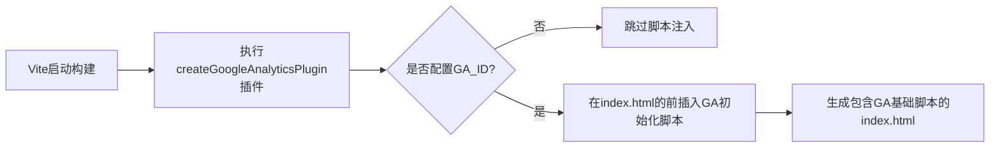
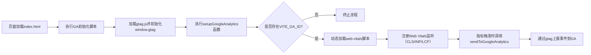

# web-vitals & google-analytics

- 简单来说就是通过vite插件的`transformIndexHtml`方法动态插入`script`代码块，让<WBaseLink preset="gtag-js">gtag.js</WBaseLink>最先加载，这样window对象上就有需要的`dataLayer`了
- 然后就是项目入口处引用`setupGoogleAnalytics`，还是通过动态加载script标签的方式（这回是vueuse的useScriptTag）加载<WBaseLink preset="web-vitals">web-vitals</WBaseLink>，然后就是上报指标了

:::tabs
== 插件

== 运行

:::
