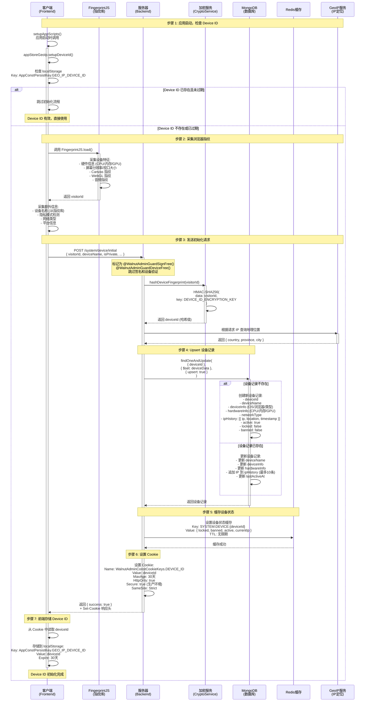
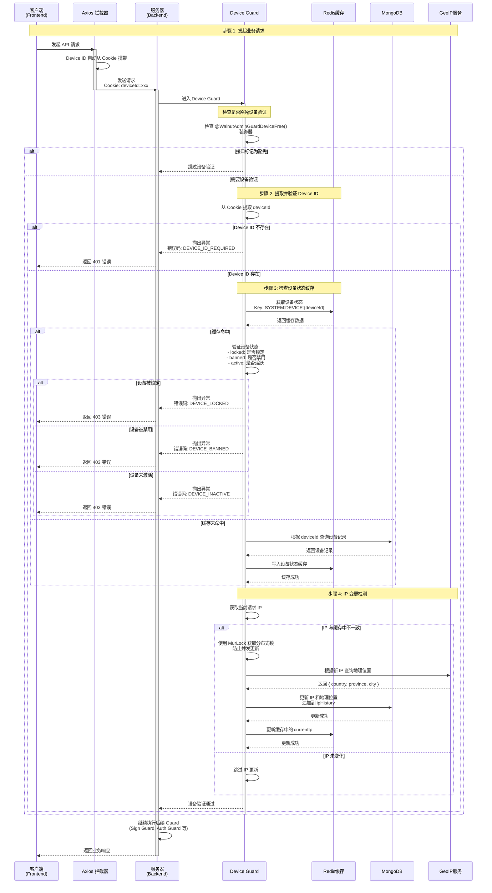

# <WPageTitle></WPageTitle>

:::warning
- 由claude生成
:::

## 介绍

在现代 Web 应用中，设备标识（Device ID）是实现安全防护、用户追踪、会话管理的基础设施。Walnut Admin 实现了一套基于浏览器指纹和服务端哈希的设备标识系统。

这套机制的核心思想是：

1. **浏览器指纹采集**：客户端通过 FingerprintJS 等指纹库采集设备特征（硬件信息、屏幕分辨率、网络类型等）
2. **服务端哈希生成**：将指纹 ID 通过 HMAC-SHA256 哈希生成唯一的 Device ID，防止客户端伪造
3. **Cookie + LocalStorage 双重存储**：Device ID 同时存储在 Cookie（用于请求传递）和 LocalStorage（用于前端缓存）
4. **Redis 多维度关联**：Device ID 作为 Redis 缓存的 Key 组成部分，关联 RSA 公钥、AES 密钥、会话信息、权限数据等
5. **设备状态管理**：支持设备锁定、禁用、活跃状态追踪，以及 IP 变更检测

需要说明的是：

- Device ID 是整个安全体系的基石，RSA 握手、签名验证、会话管理都依赖它
- 浏览器指纹并非 100% 唯一，存在碰撞可能性（尤其是隐私模式下）
- Device ID 的生成依赖服务端密钥（`DEVICE_ID_ENCRYPTION_KEY`），确保客户端无法伪造
- 30 天过期策略平衡了安全性和用户体验

下文将详细说明 Device ID 的初始化流程、更新策略、存储结构和安全特性。

## 相关链接

- [体验地址](https://www.walnut-admin.com/)

## 关键影响维度说明

### 1. Visitor ID（浏览器指纹）

`Visitor ID` 是由 FingerprintJS 等指纹库生成的浏览器唯一标识：

- 基于硬件信息（CPU 核心数、内存、GPU）、屏幕分辨率、Canvas 指纹等
- 前端采集后发送给服务端，作为生成 Device ID 的原始输入
- 隐私模式下指纹稳定性较差，可能导致频繁重新初始化

### 2. Device ID（设备标识）

`Device ID` 是服务端通过哈希算法生成的设备唯一标识：

- 生成算法：`HMAC-SHA256(visitorId, DEVICE_ID_ENCRYPTION_KEY)`
- 存储位置：Cookie（`WalnutAdminConstCookieKeys.DEVICE_ID`）+ LocalStorage（`AppConstPersistKey.GEO_IP_DEVICE_ID`）
- 有效期：30 天（与 RSA 密钥对保持一致）
- 作用范围：全局，所有需要设备验证的接口都依赖它

### 3. 设备信息（Device Info）

服务端存储的设备详细信息：

- 设备名称、操作系统、浏览器类型、设备类型（Desktop/Mobile/Tablet）
- 硬件信息：CPU 核心数、内存大小、GPU 型号
- 网络信息：网络类型、IP 地址、地理位置（国家、省份、城市）
- 状态标识：活跃状态、锁定状态、禁用状态
- IP 历史记录：最多保留 10 条历史 IP

### 4. 设备状态管理

设备支持三种状态控制：

- **活跃状态（active）**：设备是否处于活跃状态，影响是否允许访问
- **锁定状态（locked）**：设备是否被锁定，锁定后无法访问任何接口
- **禁用状态（banned）**：设备是否被禁用，禁用后无法登录和访问

## 流程图

:::tabs
== Device ID 初始化流程

== Device ID 验证与更新流程

:::

## 与其他系统的协作

### Device ID 在签名系统中的作用

Device ID 是签名系统的核心锚点。签名相关的所有密钥（RSA 公钥、AES 密钥）都通过 Device ID 在 Redis 中索引。当 Device ID 发生变化时，签名系统会触发完整的重新握手流程。

详细的签名流程请参考 [签名验证机制](/content/shared/sign)。

### Device ID 在认证系统中的作用

认证系统中，Device ID 参与以下维度：

- **会话管理**：Session 的 Redis Key 包含 Device ID（`AUTH:SESSIONS:{userId}:{deviceId}:{sessionId}`），支持按设备维度管理会话
- **权限缓存**：权限缓存按 `userId + deviceId` 粒度隔离，支持不同设备不同权限
- **MFA 验证**：MFA 验证状态绑定到 `userId + deviceId`，切换设备需要重新验证
- **用户锁定**：登录失败锁定按 `userId + deviceId` 粒度，不影响同一用户的其他设备

## 补充说明

### 安全特性

1. **服务端哈希生成** - Device ID 由服务端通过 HMAC-SHA256 生成，客户端无法伪造
2. **密钥隔离** - 使用独立的环境变量 `DEVICE_ID_ENCRYPTION_KEY` 作为 HMAC 密钥
3. **HttpOnly Cookie** - Device ID 存储在 HttpOnly Cookie 中，防止 XSS 攻击窃取
4. **SameSite Strict** - Cookie 设置 SameSite: Strict，防止 CSRF 攻击
5. **设备状态控制** - 支持远程锁定、禁用设备，实现设备级别的访问控制
6. **IP 变更追踪** - 自动检测和记录 IP 变化，辅助异常行为分析
7. **分布式锁** - IP 更新使用 MurLock 分布式锁，防止并发写入冲突

### 存储策略

| 存储位置 | 内容 | 有效期 | 用途 |
|---------|------|-------|------|
| Cookie | Device ID | 30天 | HTTP 请求自动携带 |
| LocalStorage | Device ID | 30天 | 前端缓存，避免重复初始化 |
| MongoDB | 设备详细记录 | 永久 | 设备信息持久化 |
| Redis | 设备状态缓存 | 无限期 | 高频读取场景 |

### 性能优化

1. **缓存优先** - 设备状态优先从 Redis 读取，减少数据库查询
2. **Upsert 操作** - 初始化时使用 `findOneAndUpdate` 的 upsert 模式，一次操作完成创建或更新
3. **MurLock 分布式锁** - IP 变更时使用分布式锁，防止并发请求导致重复写入
4. **IP 历史限制** - ipHistory 最多保留 10 条记录，防止数据无限增长
5. **豁免机制** - 使用 `@WalnutAdminGuardDeviceFree()` 装饰器豁免不需要设备验证的接口（如初始化接口本身）

### 局限性

1. **浏览器指纹不稳定** - 隐私模式、浏览器更新、插件变化等因素可能导致指纹变化，触发重新初始化
2. **Cookie 依赖** - 如果用户禁用 Cookie，设备标识将无法正常工作
3. **30 天过期** - 过期后需要重新初始化，用户体验上可能产生短暂的额外请求
4. **单设备 ID 维度** - 同一浏览器的多个标签页共享同一个 Device ID，无法区分不同标签页
5. **无跨浏览器关联** - 同一物理设备的不同浏览器会被视为不同设备
