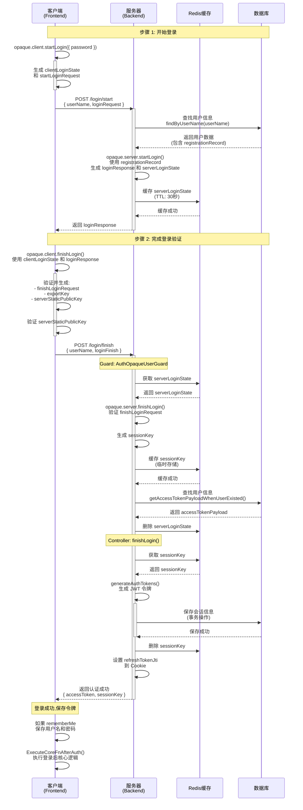
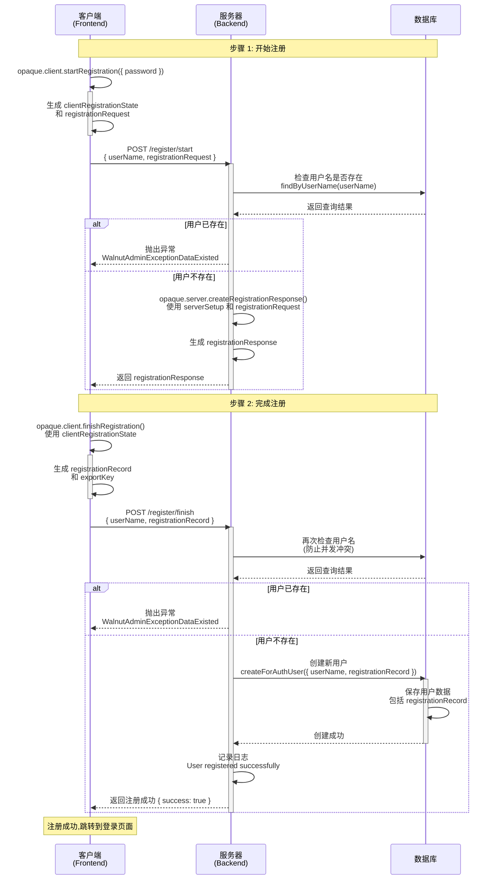

# <WPageTitle></WPageTitle>

:::warning
- 内容由免费的闪电说提供语音识别，再由gpt提供的去口头化润色
- 流程图由claude生成
:::

## 介绍

在调研现代密码认证方案的过程中，我最初接触到的是 SRP（Secure Remote Password）协议。
SRP 的核心思想是：密码始终只保存在客户端，登录过程中不会将明文密码发送至服务端，从而降低服务端因数据泄露导致密码被窃取的风险。

基于这一特性，我曾尝试将 SRP 集成到现有系统中。但在 Node.js 生态中，能够实际使用且仍然维护的 SRP 实现非常有限，相关库大多处于不活跃状态，难以满足生产环境的需求。

在进一步的调研中，我了解到 OPAQUE 协议。OPAQUE 可以视为在 SRP 思想基础上的一次重要演进：
它在安全模型上进行了改进，解决了 SRP 已知的一些安全隐患，并采用了更现代的密码学设计，被认为是当前较为先进的 PAKE（Password-Authenticated Key Exchange）协议之一。

与 SRP 不同的是，OPAQUE 在 Node.js 社区中已经出现了较为活跃且可用的第三方实现，并且具有一定的社区关注度。因此，我最终选择将 OPAQUE 协议从前端到后端完整集成到系统中。

从实现角度来看，OPAQUE 底层涉及较为复杂的密码学原语和协议细节；但对于应用开发者而言，实际需要理解和控制的变量与流程是有限的。只要正确处理这些关键参数，即可安全地完成整个认证流程，而无需深入实现底层密码学算法。

下文将提供相关参考链接，便于进一步了解 OPAQUE 协议的设计与原理。同时，也会给出当前系统中已实现部分的流程图，用以直观展示前后端在认证过程中的整体交互与数据流转。

## 相关链接

- [体验地址](https://www.walnut-admin.com/)
- [OPAQUE RFC](https://datatracker.ietf.org/doc/rfc9807/)
- [项目中前后端实际用的opaque库](https://github.com/serenity-kit/opaque)
- [库的文档](https://opaque-auth.com/)
- [OPAQUE 协议在 Facebook 中的实现 RUST 版本](https://github.com/facebook/opaque-ke)

## 关键影响维度说明

在 OPAQUE 协议的实际集成与使用过程中，有以下 **三个关键维度** 会直接影响整个密码体系的有效性。这些参数一旦发生变更，将导致现有用户密码整体失效，因此需要格外谨慎对待。

### 1. Username（用户名）

由于 OPAQUE 的认证流程中 **不会将密码发送到服务端**，`username` 成为了整个密钥交换过程中的**核心标识位**之一，用于参与密码相关数据的派生与计算。

因此：

- `username` **不应被轻易修改**
- 如果系统后续确实需要支持用户名变更
  → 则 **必须重新生成对应的 OPAQUE 密码数据**
- 否则会导致用户无法通过原有密码完成认证

从协议角度来看，`username` 并不仅仅是一个业务字段，而是密码学流程中的一部分输入。

---

### 2. Server Setup（服务器初始化参数）

在用户注册或登录流程中，后端会通过 OPAQUE Server 执行一次 `setup` 操作，生成一个 **Server Setup 字符串**。

该参数具有以下特性：

- 由后端 OPAQUE Server 生成
- 强烈建议：
  - 存储在 **后端环境变量** 中
  - 初始化后 **不要随意更改**

⚠️ **重要说明**
一旦该 `Server Setup` 参数发生变化：

- 所有已注册用户的 OPAQUE 密码数据将全部失效
- 通过账号密码方式的登录将无法继续使用

因此，该参数应被视为 **全局、不可变的系统级安全配置**。

---

### 3. Server Identifier（服务端标识 / App Name）

在注册或登录过程中，OPAQUE 协议还会使用一个 `identifier` 作为服务端的唯一标识。

在当前系统中，该字段对应的是：

- 应用的 **App Name**
- 一个固定的英文字符串

推荐实践如下：

- 使用稳定、不易变更的英文字符串
- 将其：
  - 存储在后端环境变量中，或
  - 通过统一的应用管理接口进行下发
- **避免频繁修改 App Name / Identifier**

同样地，一旦该标识发生变更，也会导致：

- 现有用户的所有密码数据失效
- 用户需要重新设置密码

---

### 总结

以下任意一个维度发生变更，都会导致 **整个用户库中的密码全部失效**：

- `Username`
- `Server Setup`
- `Server Identifier（App Name）`

因此，在系统设计阶段，应将上述参数明确标记为 **高风险、强约束配置项**，并在产品与技术层面尽量避免后期变更。

## 补充说明

### ExportKey

在通过 OPAQUE 协议完成登录认证后，前端还会获得一个由协议导出的 **Export Key**。

根据 OPAQUE 协议的设计说明，该 `Export Key` 可作为后续安全能力的基础，例如：

- 用于 **端到端加密（End-to-End Encryption, E2EE）**
- 派生会话级别的对称密钥
- 用于客户端与客户端，或客户端与服务端之间的加密通信

在当前项目中，该能力尚未实际启用，`Export Key` 仅作为登录流程中的一个可扩展产物保留，并未参与现有的业务逻辑。

不过，从安全架构角度来看，`Export Key` 为系统提供了进一步增强安全性的可能性。
对于对密码学或端到端加密感兴趣的读者，可以基于该 Key 深入探索 OPAQUE 在 **零知识认证 + E2EE** 场景下的应用，这也是该协议中一个非常有价值且具有扩展潜力的设计点。

## 流程图

:::tabs
== 登录

== 注册

:::
