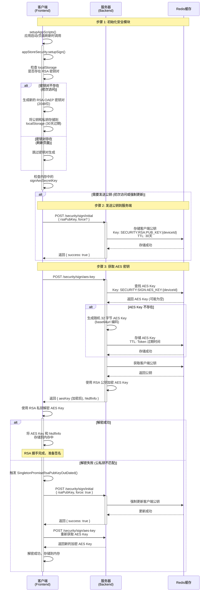
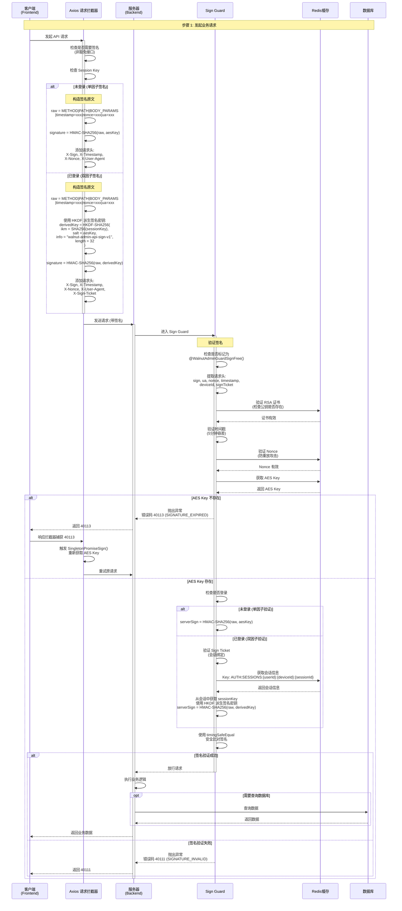

# <WPageTitle></WPageTitle>

:::warning
- 内容由免费的闪电说提供语音识别，再由gpt提供的去口头化润色
- 流程图由claude生成
:::

## 介绍

在现代 Web 应用中，API 接口的安全防护是一个重要课题。为了防止接口被恶意调用、参数篡改、重放攻击等安全威胁，我在项目中实现了一套基于 RSA + AES + HMAC 的接口签名验证机制。

这套机制的核心思想是：

1. **RSA 非对称加密握手**：客户端生成 RSA 密钥对，将公钥发送给服务端，服务端使用该公钥加密 AES 密钥后返回，确保 AES 密钥在传输过程中的安全性
2. **AES 对称密钥**：用于后续的签名计算，避免每次都使用 RSA 进行加密（性能开销大）
3. **HMAC-SHA256 签名**：对请求的关键信息（方法、路径、参数、时间戳、随机数等）进行签名，服务端验证签名的一致性
4. **双因子签名**：登录后结合用户会话密钥（Session Key）和设备密钥（AES Key）进行 HKDF 派生，生成更强的签名密钥

这套方案参考了抖音 Web 端的接口防护思路，但进行了简化和调整，使其更适合中后台系统的场景。

需要说明的是：

- 这种防护方案主要用于 C 端接口，防止爬虫、脚本等自动化工具的滥用
- 对于懂逆向的攻击者，前端代码是完全透明的，因此这套方案并非绝对安全
- 实际生产环境中，还需要结合 IP 限流、设备指纹、行为分析等多种手段
- 项目中加入这套机制主要是出于技术兴趣和学习目的

下文将详细说明 RSA 握手流程和 Sign 签名流程，并提供完整的流程图。

## 相关链接

- [体验地址](https://www.walnut-admin.com/)
- [前端代码仓库](https://github.com/Zhaocl1997/walnut-admin-client)
- [后端代码仓库](https://github.com/Zhaocl1997/walnut-admin-server)

## 关键影响维度说明

在实际使用过程中，以下几个关键参数会直接影响整个签名体系的有效性：

### 1. Device ID（设备标识）

`Device ID` 是客户端的唯一标识，用于在服务端区分不同的设备。在当前实现中：

- 由前端生成并存储在 `localStorage` 中
- 作为 Redis 中 RSA 公钥、AES 密钥等数据的 Key 的一部分
- 一旦 Device ID 发生变化，需要重新进行 RSA 握手

### 2. RSA 密钥对

客户端生成的 RSA-OAEP 密钥对（2048 位）：

- 公钥发送给服务端，用于加密 AES 密钥
- 私钥存储在 `localStorage` 中（使用 AES-GCM 加密存储）
- 有效期为 30 天，过期后需要重新生成

### 3. AES 密钥

服务端生成的 AES 密钥（32 字节）：

- 用于单因子签名的 HMAC 密钥
- 用于双因子签名的 HKDF Salt
- 存储在 Redis 中，过期时间与 Token 一致
- 一旦过期，客户端会收到错误码 `40113`，需要重新获取

### 4. Session Key（会话密钥）

用户登录后，服务端返回的会话密钥：

- 用于双因子签名的 HKDF IKM（Input Keying Material）
- 存储在 `localStorage` 中，有效期 24 小时（滑动过期）
- 退出登录后会被清除

### 5. HKDF Info

HKDF 派生过程中的 Info 参数：

- 固定值：`walnut-admin-api-sign-v1`
- 用于区分不同的派生用途
- 如果该值发生变化，会导致签名验证失败

## 流程图

:::tabs
== RSA 握手流程

== Sign 签名流程

:::

## 补充说明

### 单因子签名 vs 双因子签名

**单因子签名（未登录状态）：**
- 仅使用设备级别的 AES 密钥进行签名
- 适用于注册、登录等公开接口
- 安全性较低，但足以防止简单的脚本攻击

**双因子签名（已登录状态）：**
- 结合用户会话密钥（Session Key）和设备密钥（AES Key）
- 使用 HKDF 派生出独立的签名密钥
- 安全性更高，支持按用户粒度吊销
- 即使 AES Key 泄露，攻击者也无法伪造签名（需要 Session Key）

### 错误码说明

- `40111: SIGNATURE_INVALID` - 签名验证失败
- `40112: SIGNATURE_CERTIFICATE_INVALID` - RSA 证书无效（未完成握手）
- `40113: SIGNATURE_EXPIRED` - AES 密钥过期或不存在
- `40114: SIGNATURE_TIMESTAMP_INVALID` - 时间戳无效（超出 5 分钟容差）
- `40115: SIGNATURE_NONCE_INVALID` - Nonce 无效（重放攻击）

### 安全特性

1. **RSA 证书握手** - 防止中间人攻击，确保 AES 密钥传输安全
2. **时间戳验证** - 5 分钟窗口，防止重放攻击
3. **Nonce 去重** - Redis 存储 5 分钟，防止重复请求
4. **Sign Ticket** - 会话绑定，防止跨会话攻击
5. **HKDF 派生** - 从一个高熵密钥派生多个独立子密钥
6. **timingSafeEqual** - 防止时序攻击
7. **双因子签名** - 结合用户会话和设备密钥，安全性更高

### 性能优化

1. **单例 Promise** - 避免并发请求时重复获取 AES Key
2. **内存缓存** - AES Key 和 HKDF Info 存储在内存中，避免频繁读取 localStorage
3. **Redis 缓存** - RSA 公钥、AES Key、Nonce 等数据存储在 Redis 中，快速读写
4. **豁免机制** - 使用 `@WalnutAdminGuardSignFree()` 装饰器豁免不需要签名的接口

### 局限性

1. **前端代码透明** - 签名逻辑在前端完全可见，懂逆向的攻击者可以绕过
2. **设备指纹简单** - 仅使用 Device ID，未结合浏览器指纹、Canvas 指纹等
3. **无行为分析** - 未结合用户行为分析、风控模型等
4. **依赖 localStorage** - RSA 密钥对存储在 localStorage 中，存在被窃取的风险

因此，这套方案更适合作为基础防护手段，需要结合其他安全措施（如 IP 限流、设备指纹、行为分析等）才能达到较高的安全水平。
