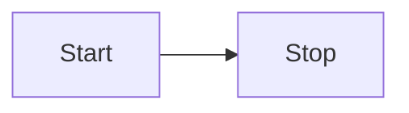

# 介绍

## 前言

简单描述下我的后台接触经历吧。

最开始也是自学的 nodejs 课程，udemy 的[andrewmead](https://www.udemy.com/user/andrewmead/)的课程，感觉十分不错，吐字清晰课程也是循序渐进的，英语基础不差的朋友可以试试（当然是指对于新接触 nodejs 的朋友来说）。

然后就是 express + mongodb 了，当时也开始接触一些后台的概念，中间件缓存啥的，也没特别深入，简单完成了增啥改查的没问题。

越过了 koa，我直接就来到了 nestjs 的时代。一开始接触 nestjs 发现有些概念好高级，什么 dto\entity 之类的，因为在之前的 express 项目中没接触过，而且语法感觉有点像 java 的意思，尤其是那些自定义装饰器特别吸引我，就入了坑。

后来也考虑过转到微服务版本的 nestjs，奈何水平精力有限，遇到的困难也有点多，就放弃了。还是回到了中规中矩的单体应用。

现在的 nestjs 后台包含的内容可以说不少了，缓存、消息队列、定时任务、oauth 认证等等，和一个体量不小的 java 后台可以说是班对班了。包括 nestjs 的 guard 和 intercepetor 等的概念，中间件就不说了，等等。你会发现你能学到的后台只是还是不少的，强烈推荐感兴趣的朋友深入接触哈。

## 基本描述

:::info
后续我会补充一个更直观的架构图的
:::

从概念上包括了以下模块：

- 认证模块：包括了鉴权授权和oauth
- 角色模块：RBAC的基础角色模块
- 用户模块：RBAC的基础用户模块
- 菜单模块：RBAC的基础权限模块，因为对应了前端的左侧菜单，所以叫做了菜单模块
- i18n模块：包括语言模块和词条模块
- 日志模块：包括登录日志和操作日志

从nestjs的modules的概念上包括了以下模块：

- 

