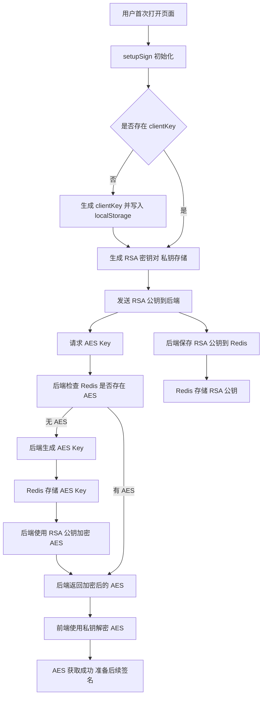
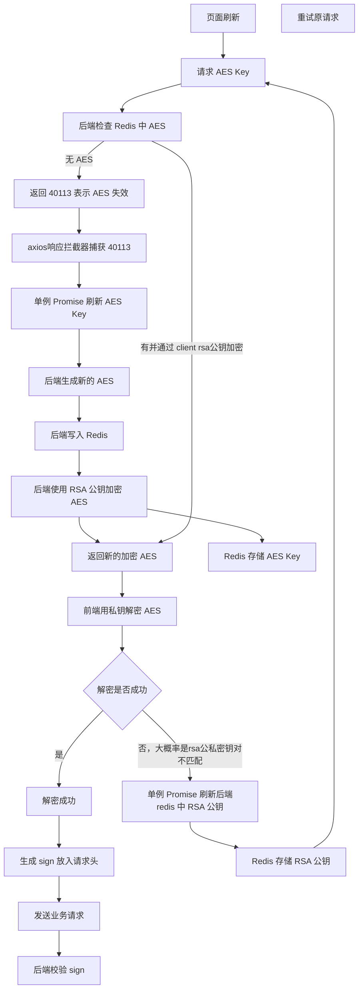

# <WPageTitle></WPageTitle>

:::warning
- 我个人是偶然间打开web端抖音然后F12发现有rsa密钥对才开始通过配合ai研究的这套防护流程
- 纯纯c端接口才会需要的东西，项目中加这个主要是感兴趣，实际项目中很少有接口需要这种程度的防护
- 最主要可能就是像抖音那种防止爬虫或者脚本去爬接口，不过会逆向的或者懂行的这种程度的也是防不住的，毕竟一个F12一打开，web端没有什么秘密，前端总要有个地方去拼接sign，这部分代码在客户端就是裸奔的
- 抖音实际的操作流程应该是比这个复杂很多，它们应该都自己的sdk封装，签名的部分应该会复杂很多很多，我这个只是一个很简单的复现，感兴趣的github上有[开源项目](https://github.com/tikvues/tiktok-api)
- 有很多细节下面流程图中体现不出来，前端代码是完全开源的，感兴趣的可以看一下
- 签名的部分内容可以有很多文章去做，我看了一下GitHub上的逆向开源项目后后续可能对签名的部分进行一些补充
:::

:::tabs
== 首次打开页面流程

== 刷新页面流程

:::
