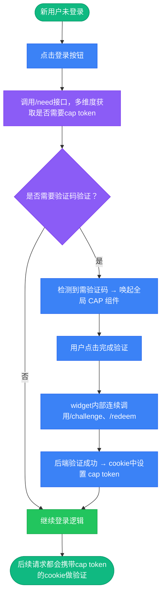
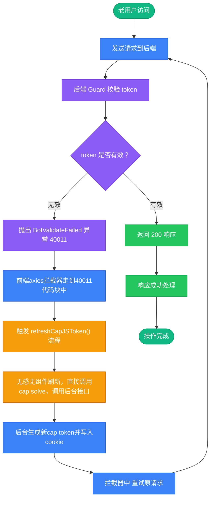

# capjs人机校验

cap.js [官网](https://capjs.js.org) [仓库](https://github.com/tiagozip/cap) 一款开源的，十分简单的人机校验方案，同时功能也比较完善。

本来也一直想做类似reCaptcha的人机校验功能，正好无意中刷到了这个项目，一看仓库作者也是很用心，而且是完全开源的，就决定尝试一下。

后端可以像我一样集成到项目中，也有一个standalone的版本。社区也有各种版本，java/go/python等等，都可以前去尝试。

:::info
项目默认是全局的cap token guard守卫的，如果有不重要的公共接口就做cap token free处理，也就是添加一个cap token free的guard。
:::

:::tabs
== 新用户流程

== 老用户流程

:::
